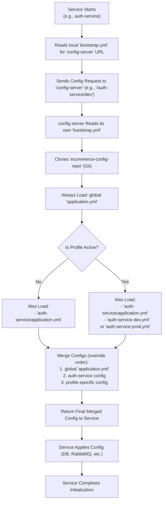

# 🗂️ Config Repo – E-commerce Backend

This repository stores configuration files for all microservices in the e-commerce backend.  
It works with the Spring Cloud Config Server to deliver the right config values to each service at runtime.

Each environment (like `dev`, `test`, or `prod`) can have its own settings — making it easy to manage configuration in one central place.

--- 
## 📂 Structure

```
ecommerce-config-repo/
├── auth-service/
│   ├── application.yml             # Common configuration for auth service
│   ├── auth-service-dev.yml        # Dev-specific configuration for auth service
│   └── auth-service-prod.yml       # Prod-specific configuration for auth service
│
├── order-service/
├── inventory-service/
├── product-service/
├── payment-service/
├── notification-service/
│   └── ...                         # Each service follows the same structure as auth-service
│
├── application.yml                 # Shared configuration (e.g., logging, health checks)
└── README.md                       # Documentation of the config repo structure
```

- Each service has its own folder with default and environment-specific files
- Profile-specific files (-dev, -test, -prod) enable environment-specific overrides

---

## 🔧 Usage

Microservices connect to the Config Server using a local `bootstrap.yml` like:

```yaml
spring:
  config:
    import: optional:configserver:http://localhost:8888
```

At startup, services load:
- The global `application.yml`
- Their own `application.yml`
- Their active profile overrides (e.g., `auth-service-dev.yml`)

The Config Server fetches configuration from this repo and delivers it to the services.

---

## 🔁 Configuration Loading Example

Fetching configuration for `auth-service` with the `dev` profile:

```bash
GET http://localhost:8888/auth-service/dev
```

The following files are merged in order:

1. `application.yml` (global)
2. `auth-service/application.yml`
3. `auth-service/auth-service-dev.yml`

---

## 🏛️ Configuration Management Flow

### Local (Each Microservice)

| File            | Purpose                                           |
|-----------------|---------------------------------------------------|
| `bootstrap.yml` | Connect to the Config Server and declare service name |
| `application.yml` | (Optional) Used only for local overrides or testing without Config Server |

### Config Repo (`ecommerce-config-repo/`)

| File                                    | Purpose                                  |
|-----------------------------------------|------------------------------------------|
| `application.yml` (root)                | Global shared settings for all services  |
| `{service-name}/application.yml`        | Default settings per service             |
| `{service-name}/{service-name}-dev.yml` | Dev environment overrides                |
| `{service-name}/{service-name}-prod.yml`| Prod environment overrides               |

### Config Server (`ecommerce-config-server/`)

| File            | Purpose                                 |
|-----------------|-----------------------------------------|
| `bootstrap.yml` | Connect to the Git config repo          |

---

## 🧠 How Configuration Is Resolved (Step-by-Step)

When a microservice (e.g., `auth-service`) starts up, it retrieves its configuration from this central config repository through the Spring Cloud Config Server. Here's how the process works:

### 🔁 Configuration Resolution Flow

1. **Microservice Startup**  
   The service (e.g., `auth-service`) starts and loads its own `bootstrap.yml`, which contains the URL of the Config Server.

2. **Request to Config Server**  
   It sends a configuration request to the Config Server (e.g., `http://localhost:8888/auth-service/dev`).

3. **Config Server Bootstraps**  
   The Config Server reads its own `bootstrap.yml`, which points to this Git repo (`ecommerce-config-repo`) as the source of truth.

4. **Git Repository Fetched**  
   The Config Server clones or pulls this repository.

5. **Global Configuration Loaded**  
   The root-level `application.yml` is always loaded first. This contains shared config (e.g., logging, actuator, tracing) applied to all services.

6. **Service Configuration Loaded**  
   Then, the service-specific file (`auth-service/application.yml`) is loaded.

7. **Profile-Specific Configuration (Optional)**  
   If a profile is active (like `dev` or `prod`), the corresponding file (`auth-service-dev.yml`) is loaded next.

8. **Merge and Override**  
   The configurations are merged in this order:
   - Global `application.yml` (lowest priority)
   - Service-level config
   - Profile-specific config (highest priority)

9. **Final Config Sent to Service**  
   The merged configuration is returned to the microservice, which uses it to initialize database connections, ports, RabbitMQ settings, and more.

### 🔍 Visual Overview


### 🛠️ Why This Matters

Centralizing configuration this way allows:
- Consistent environment management (`dev`, `prod`, etc.)
- Separation of concerns — services don’t hardcode credentials
- Easy config updates via Git version control
- Immediate visibility for observability and logging settings

---

## 🔐 Secrets & Security Roadmap

This project is evolving its approach to secrets management. Here's how it's handled across different stages:

### ✅ Right Now (Development)
- Example values (like `authuser` / `authpass`) are stored in config files for local testing
- These are **not real secrets** — just placeholders for dev use

### 🔜 Coming Soon (Staging)
- Move real secrets (like database passwords) out of config files
- Use **Docker Secrets** or `.env` files to pass in sensitive info securely

### 🚀 Future Plans (Production)
- Use a secure tool like **HashiCorp Vault** to store and manage secrets
- Load secrets automatically during deployment using CI/CD
- Add strict access rules and track who accesses what

---


## 🧱 Related Services

- Infrastructure & Core Services
    - [ecommerce-infra](https://github.com/AlexisRodriguezCS/ecommerce-infra) — Infrastructure setup with Docker, CI/CD, ELK logging, Postman, and documentation
    - [ecommerce-config-repo](https://github.com/AlexisRodriguezCS/ecommerce-config-repo) — Git repo for configs **(this repo)**
    - [ecommerce-config-server](https://github.com/AlexisRodriguezCS/ecommerce-config-server) — Centralized configuration service 
    - [ecommerce-discovery-server](https://github.com/AlexisRodriguezCS/ecommerce-discovery-server) — Eureka-based service registry
    - [ecommerce-api-gateway](https://github.com/AlexisRodriguezCS/ecommerce-api-gateway) — API gateway with routing, JWT validation, and rate limiting

- Microservices
    - [ecommerce-auth-service](https://github.com/AlexisRodriguezCS/ecommerce-auth-service) — User authentication and JWT management
    - [ecommerce-product-service](https://github.com/AlexisRodriguezCS/ecommerce-product-service) — Product catalog creation, updates, and search
    - [ecommerce-inventory-service](https://github.com/AlexisRodriguezCS/ecommerce-inventory-service) — Inventory tracking and stock adjustments
    - [ecommerce-order-service](https://github.com/AlexisRodriguezCS/ecommerce-order-service) — Order processing and checkout workflows
    - [ecommerce-payment-service](https://github.com/AlexisRodriguezCS/ecommerce-payment-service) — Secure payment processing
    - [ecommerce-notification-service](https://github.com/AlexisRodriguezCS/ecommerce-notification-service) — Email and SMS notifications for order events

---

## 📬 Contact

Maintained by [Alexis Rodriguez](https://github.com/AlexisRodriguezCS)
